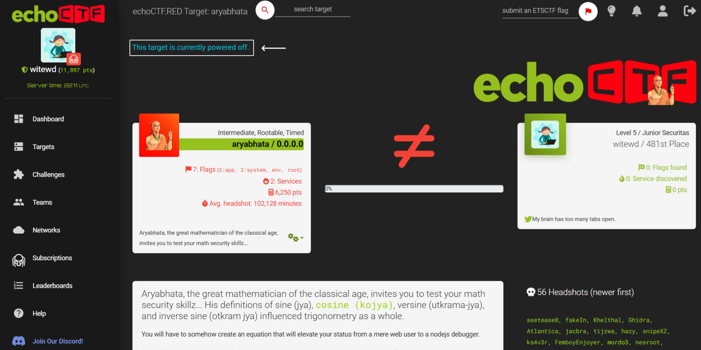
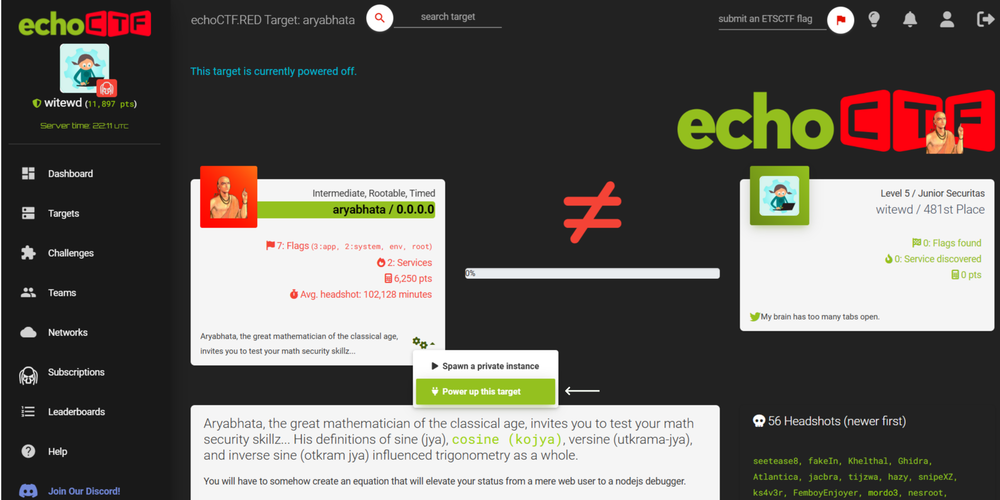
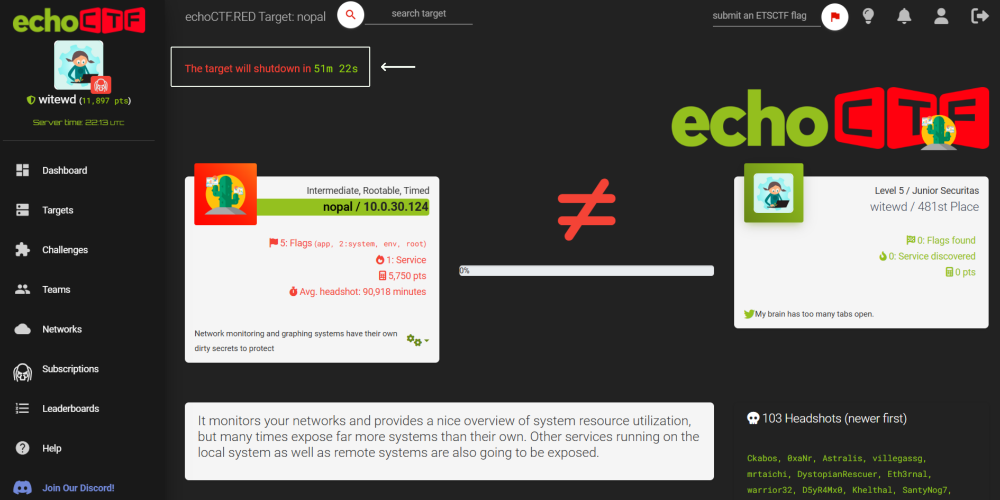

# Targets
This section contains the list of the vulnerable machines you can attack. 

## Key Elements on the Targets Listing Page

### Header Functionality
  - The **search bar** at the top allows you to search for a target by its name.
  - The **Submit a Flag** button, located prominently in the top-right corner of the header, is a core feature of the EchoCTF.RED platform. This button provides a quick and accessible way to submit captured flags you have found during your interaction with a target.

  
### Stats
At the top of the Targets Page, you can view your progress with the following metrics:
  - **Flags**: Total number of flags captured.
  - **Services**: Number of unique services found and identified.
  - **Headshots**: Number of headshots achieved. A headshot is achieved when you own all the flags and services of a target.
  - **Points**: Accumulated score from your overall progress.

### Target List 
Below the stats is a comprehensive list of currently available targets. The Targets table consists of the following columns:
- **Target**: The name of the target. You can sort the targets by their name in ascending or descending order by clicking on the "Target" column header.
- **IP**: The assigned virtual IP address of the target.  Machines displaying the IP address 0.0.0.0 **must be powered on** before they can be interacted with. This ensures resources are allocated for the challenge. Detailed instructions on how to power a machine will be provided later in this manual.
- **Book Icon**: Indicates that the target has associated writeups available for reference.
- **Battery Icon**: The difficulty of the target. The targets are ranked according to their levels of difficulty as follows:
  - Beginner
  - Basic
  - Intermediate
  - Advanced
  - Expert
  - Guru
  - Insane
- **#**: Indicates whether a target is rootable or not.
- **Fingerprint Icon**: Displays the total number of exploitable services on the target and tracks how many you have identified.
- **Flags Icon**: Shows the total number of flags available on the target and keeps count of how many you have successfully captured.
- **Skull Icon**: The number of users who have headshoted a target.
- **Progress**: A visual progress bar indicating the completion level for each target.
- **Actions**:
  - **Eye Icon**: Click to view more details about the target.
  - **Twitter Icon**: Share the target progress on Twitter.

# Target Page
The Target Page provides detailed information about a specific target, including its status, metrics, and activity. It allows you to focus on individual targets, track their progress, and interact with available resources and activities.

To access a specific target, click on its **name** or the **Eye Icon** on the target listing page.

At the top of the page, a notification highlights the current state of the target. If you are not connected to the VPN the following message appears: "This target is currently powered off. Connect to the VPN to be allowed to power the system up."

## Key Elements on the Target Page
### Target Information (Left Panel)
This panel provides all the essential details of the selected target:

- **Difficulty** and **Attributes**: Displays the difficulty level of the target (e.g., Beginner, Intermediate) along with additional attributes such as **Rootable** and **Timed** (if the target is associated with a time limit).
- **Target Name** and **IP Address**: Shows the name and the IP address of the target.
    - **IP Address 0.0.0.0**: Indicates that the target is currently offline and requires powering up to interact with it.
- **Flags**: Specifies the number and types of flags available for the target. The most common flags are:
  - **root**: Flag under /root
  - **env**: Environment variable flags
  - **system**: Flags on system file (eg. /etc/shadow, /etc/passwd)
  - **app**: Application-specific flags (eg. MySQL database name flags, Memcache keys etc)
  - **other**: For any flags that do not fit into the above categories.
- **Services**: The number of exploitable services.
- **Points**: The total points that can be earned by capturing all flags and exploiting all services.
- **Average Headshot Time**: Shows the average time other users have taken to successfully headshot the target.
- **Description**: Provides a short textual description or hint for the challenge. 
- **Gear Icon**: Clicking this icon allows you to perform actions related to the target, such as:
  - Spawn a target
  - Power up a target
  - Restart a target
 
### User Information (Right Panel)
This panel displays your stats and target progress:

- **Level and Ranking**: Displays your level and your current rank on the leaderboard.
- **Flags and Services Found**: Tracks your progress for this specific target, showing the number of flags captured and services discovered.
- **Points Earned**: Tracks your points earned for this target.
- **Twitter Integration**: Allows you to share your progress on social media.

### Comparison and Progress Bar

- Initially, a ≠ symbol represents the gap between your current progress and the target's completion.
- Located beneath the comparison symbol, the progress bar visually tracks your completion percentage for the target, providing a clear overview of your status.
- Once you successfully headshot a target, the symbol changes to a skull icon, signifying the target has been conquered.
- Upon successful headshot of a target, two buttons are displayed below the progress bar to further interact with it:
  - **Share Button**: Enables you to share your achievement on different platforms.
  - **Not Rated Button**: Allows you to rate the difficulty of the target. The rating options range from Beginner to Insane. **By rating a target, you help the platform better assess and refine its difficulty level, benefiting the community.**
 
### Detailed Target Description
A detailed message or thematic description of the target is displayed here. This message can act as a clue to hack the target.

### Headshots
This section displays a chronological list of users who have successfully headshotted the target, starting with the most recent headshot achievers. 

### Writeups
The writeups section displays contributions from users who have written writeups for the target. Writeups are rated with a numeric score and brief description, indicating the quality of the guide.

To enable a writeup click on it.

>[!CAUTION]
>Enabling access to writeups will reduce your remaining flags' points by 50%.

### Activity Stream (Bottom Section)
At the bottom section, an activity stream provides a live feed of actions performed by participants on this specific target. Each log entry includes:
- **Username**: The user performing the action.
- **Action Description**: Details about the action.
- **Time Information**: When the action occurred.

**Examples of logged activities**:
- Gaining access to specific flags.
- Discovering remote shell services.
- Headshot the target.

## Power Up a Target
Powering up a target is a crucial step before you can interact with it. This feature ensures that the system allocates resources for the specific target and prepares it for exploitation. Follow the steps below to successfully power up a target.

> [!IMPORTANT]
> Before attempting to power up a target, you must first connect to the EchoCTF.RED VPN. Without the VPN connection, the option to power up a target will not be available.

Once connected to the VPN you will see a "Target is currently powered off" message at the top of the page, indicating that the target is not active yet and needs to be powered on.

**Steps to power up a target**:
1. Locate and click the **gears icon**.
2. Select the **Power up this target** option.

3. A popup message will appear informing you that the target is about to be powered up.
>[!NOTE]
> Once powered up, the target becomes accessible to all users.
4. Click **OK** to proceed.
5. A notification will confirm that the target is in the power-up queue.
6. Shortly after, another notification will appear, indicating that the target has been successfully powered up.
7. Refresh the target's page to see the status update. A countdown timer will appear at the top of the page, showing the elapsed time until the target is automatically shut down.

## Spawn a Target
To spawn a target, click on the settings icon and click on spawn private instance.

The machines that already have  their IP addresses allocated have already been spawned so you don't need a private instance to access them.
